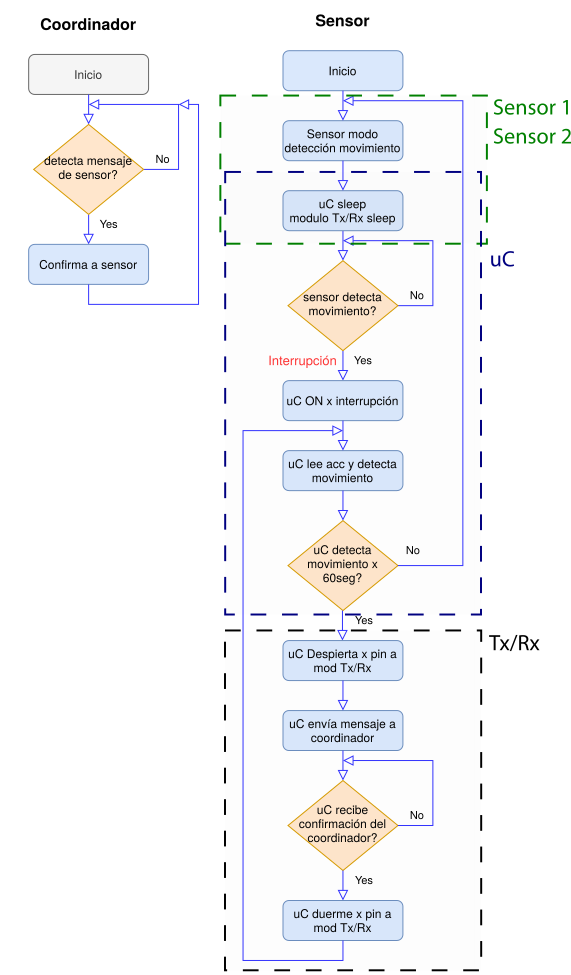

<p align="center"><p>

# Proyecto A

```
|-- Proyecto_A
    |-- ADXL362
    |-- BMA400
    |-- Fichas_Técnicas
    |-- Planos
        |-- Mecánicos
        |-- Eléctricos
    |-- XBee
```

## Descripción

#### Sensores
- ADXL362 (MEMS Acelerómetro)
- BMA400 (Acelerómetro - BOSCH)
- MPU6050 (3 Acelerómetros y 3 giróscopos)

#### Microcontrolador (uC)
- MSP430 - Texas Instruments

#### Transmisor Tx/Rx
- XBee

#### Sensor x *N*



## 1. Fichas Técnicas
En esta carpeta podemos guardar todas las fichas técnicas relacionadas al proyecto.

## 2. Planos
En esta carpeta, se debe tener separado los planos mecánicos y eléctricos relacionados al proyecto. Incluir todos los planos sobre un mismo elemento dentro de una carpeta e incluir una descripción breve del contenido en un archivo MarkDown(.md)

#### 1. Mecánicos
Planos del encapsulado para los elementos electrónicos.

#### 2. Eléctricos
Planos del circuito impreso (PCB).
- Placa A
- Placa B

- uC+Xbee+MPU6050
- Modelo ATMEGA328P-AU+MPU+XBEE3: 20mm*28mm
<p align="center"><p>

- ATMEGA328P-AU+MPU6050+XBEE3, Size: 20mm*28mm
<p align="center"><p>

- ATMEGA328P-MU+MPU+XBEE3: Size: 21mm*27mm
<p align="center">


<p>

- MPU+XBEE3: Size: 18mm*28mm
<p align="center">


<p>

- 1: PCB: ADXLE362 [SPI] + uC + XBee3
- 2: PCB: BMA400 [I2C] + uC + XBee3
- 3: PCB: BMI270 [I2C] + uC + XBee3

#### Ubicación de los sensores
Las medidas de la cavidad donde iría el circuito es de 15mmx7mm y la profundidad es de 20mm.
<p align="center"><p>
<p align="center"><p>

En la siguiente foto se muestra el Xbee3 junto con su antena en una cavidad.
<p align="center"><p>

##### Sensores
- [Sensores de Vibración](https://faire-ca-soi-meme.fr/domotique/2018/09/03/test-xiaomi-aqara-vibration-sensor/)
- [Sensor de Humedad](https://faire-ca-soi-meme.fr/hack/2017/02/27/hack-xiaomi-mi-smart-temperature-and-humidity-sensor/)
- [MSP430](http://www.ti.com/product/MSP430G2553/technicaldocuments)
- [MSP-EXP43G2](https://www.mouser.pe/ProductDetail/Texas-Instruments/MSP-EXP430G2?qs=CLImetaeaXWH2pYG%252BA%252B4Vw%3D%3D)
- [MIKROE-3149](https://www.mouser.pe/ProductDetail/Mikroe/MIKROE-3149?qs=sGAEpiMZZMve4%2FbfQkoj%252BEPi4ApqHNF8CEaaCJoKqNM%3D)
- [BMA400](https://ae-bst.resource.bosch.com/media/_tech/media/datasheets/BST-BMA400-DS000.pdf)

##### Baterías
- [Li-Po Battery 3.7V 100mAh](https://es.aliexpress.com/item/4000670261171.html?spm=a2g0o.productlist.0.0.361999f3FETcJP&algo_pvid=44eadfe1-7417-4d6e-ab31-6dcf0ca93a4d&algo_expid=44eadfe1-7417-4d6e-ab31-6dcf0ca93a4d-19&btsid=0ab6d70515831768332806760e5465&ws_ab_test=searchweb0_0,searchweb201602_,searchweb201603_)
- [Energizer CR2032](https://data.energizer.com/pdfs/cr2032.pdf)

##### Algunos links importantes
- [Motion Metrics](https://www.motionmetrics.com/)
- [Mouser](www.mouser.com)
- [Digikey](https://www.digikey.com/)
- [Kivy](https://kivy.org/#home)
- [Micropython para pycharm](https://plugins.jetbrains.com/plugin/12445-xbee-micropython)
- [Diacsa](http://www.diacsa.com/servicios.html#)
- [Módulo de comunicación Digi XBee3](https://www.digi.com/products/models/xb3-24z8um-j)

##### Videos
- [MSP430](https://www.youtube.com/watch?v=dL2YPS96L18)
- [STM32 + MPU-6050](https://www.youtube.com/watch?v=ImctYI8hgq4)

```
output = - Accel x: 64780
- Accel y: 65148
- Accel z: 64808
- Gyro x: 64808
- Gyro y: 64824
- Gyro z: 64824
```
##### Extras
- [mpu6050](https://github.com/m-rtijn/mpu6050/blob/master/mpu6050/mpu6050.py)
- [Arduino-mpu6050](https://github.com/mattzzw/Arduino-mpu6050)
