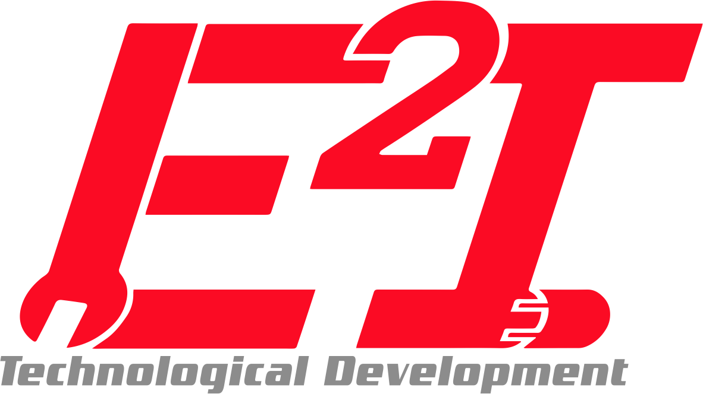

&nbsp;&nbsp;&nbsp;&nbsp;&nbsp;&nbsp;&nbsp;&nbsp;&nbsp;&nbsp;&nbsp;&nbsp;&nbsp;&nbsp;&nbsp;&nbsp;&nbsp;&nbsp;&nbsp;&nbsp;&nbsp;&nbsp;&nbsp;&nbsp;&nbsp;&nbsp;&nbsp;&nbsp;&nbsp;

&nbsp;&nbsp;&nbsp;&nbsp;&nbsp;&nbsp;&nbsp;&nbsp;&nbsp;&nbsp;&nbsp;&nbsp;&nbsp;&nbsp;&nbsp;&nbsp;&nbsp;&nbsp;&nbsp;&nbsp;&nbsp;&nbsp;&nbsp;&nbsp;&nbsp;&nbsp;&nbsp;&nbsp;&nbsp;&nbsp;&nbsp;&nbsp;&nbsp;

<!--  -->

# Proyecto1_GD
Proyecto en desarrollo, a continuación se describen las carpetas incluidas en el proyecto:

### 1. Archivos
Aqui incluiremos todos los archivos que aporten documentación al desarrollo, todos los archivos con formato *.docx* o *.pdf* dentro de la carpeta correspondiente al proyecto.

### 2.  PlayGround
Aqui cada uno puede incluir programas de prueba o borradores dentro de su carpeta correspondiente. Estos programas no pertenecen a la versión final del proyecto.

### 3. Proyecto A
Aquí incluiremos todo lo relacionado al desarrollo del Proyecto A, código, fichas técnicas y planos.

### 4. Proyecto B
Aquí incluiremos todo lo relacionado al desarrollo del Proyecto B, código, fichas técnicas y planos.
Este proyecto aún no esta definido.

### 5. Proyecto C
Aquí incluiremos todo lo relacionado al desarrollo del Proyecto C, código, fichas técnicas y planos.
Este proyecto aún no esta definido.

### 6. Proyecto GUI
Desarrollo de un Interfaz Gráfico.

#### Recursos
Aquí incluiremos principalmente imágenes de apoyo para las descripciones adicionales en los archivos README.md.

###### Extras
- Manual de uso [aquí](./Manual.md).
- Pautas de contribuyente [aquí](./CONTRIBUTING.md).
