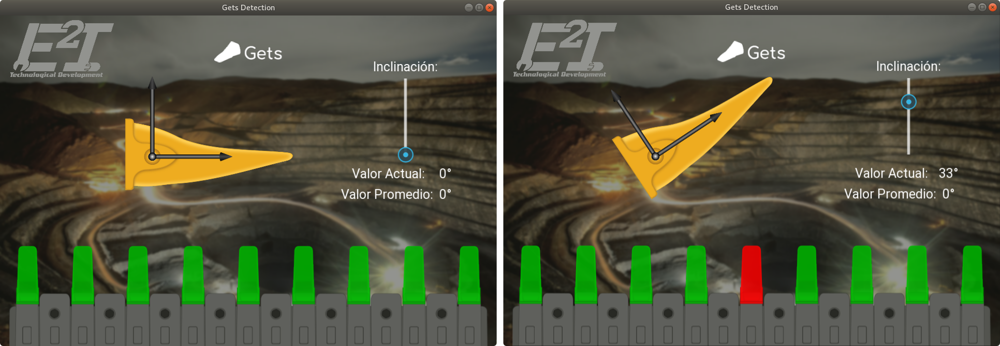

# Test kivy

Primero crear un entorno virtual:  
``
virtualenv --python python3  ~/envs/kivy_venv
``

Activar el entorno virtual:  
``
source ~/envs/kivy_venv/bin/activate
``

Instalar los programas requeridos para utilizar:  
``
pip install -r requirements.txt
``

#### Nota:
Para obtener los programas instalados utilizar:  
``
pip freeze > requirements.txt
``
